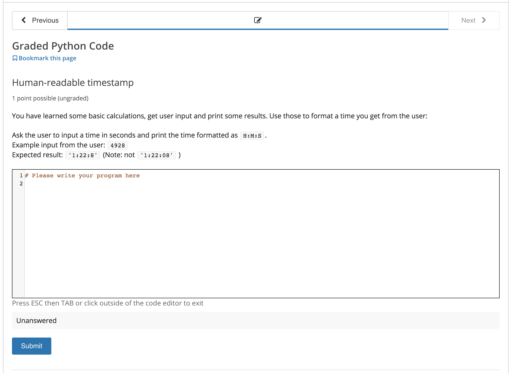
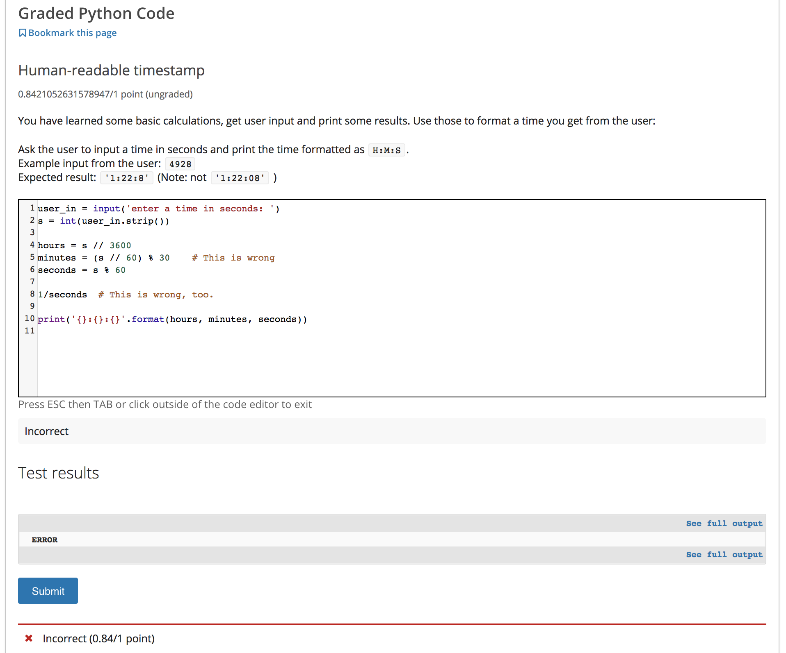
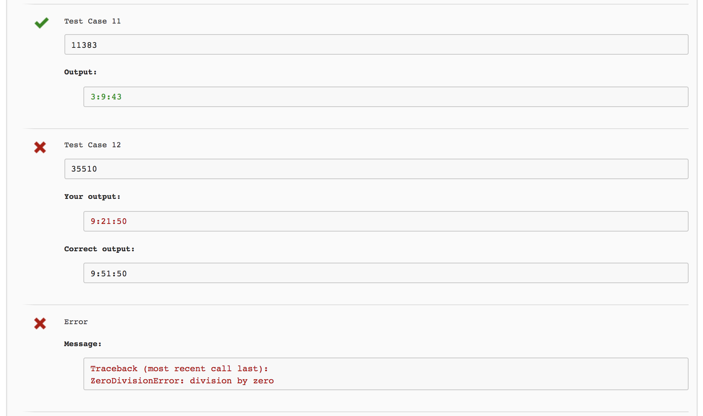

# openEDX External Grader in Python
(This is not in any way affiliated to openEDX or EDX. Just a student hack)

A simple openEDX external grader to correct Python code.

## Table of Contents  
1. [Security warning](#security)  
1. [Description](#description)  
1. [How to use this code](#usage)
  - [Run server](#run-server)
  - [Add exercise](#add-exercise)
1. [Detailed description](#doc)
  1. [Solution checker](#solutions)  
  1. [Testing your code](#tests)  
  1. [OpenEDX exercises](#advanced-blank-problem)  
  1. [Setting up the XQueue](#xqueue)  
  1. [Setting up the grader on Linux](#set-up-grader)  

<a name="security"/>
## Security Warning
This project does not make any attempt to make the evaluation secure!

Any submitted Python code will be executed without any checks. This means all system commands can be called and one can even read the expected solution. Therefore, **it is not recommended to use it for exams or exercises that count towards the final grade.**

One way to reduce these security problems is to run the code inside a virtual machine, use a user with limited rights and use `systemctl` to automatically restart it on a crash.

<a name="description"/>
## Description

This is an external grader that makes it possible to automatically evaluate Python code from students in openEDX.

You can create coding exercises with an input field:

The student can then write their code, submit it and receive feedbac and points. This score can also be displayed in the Progress tab of openEDX.

By clicking on "See full output" the student can see all test cases to figure out what was wrong with their code.

<a name="usage"/>
## How to use this code
You have to setup this grader on a server with an open port and specify this address as X-Queue in the openEDX installation. (More on that later)

<a name="run-server"/>
### To run this server:
1. Setup the XQueue in the openEDX installation (see later)
1. Change 'host' and 'port' inside `main.py`
1. run `python main.py`

<a name="add-exercise"/>
### To add new exercises:
1. Copy the template from `sample/EDX_problem.txt` into a 'Blank Advanced Problem' in your openEDX course.
  1. Change the problem ID in `"problem_name": "PROBLEM-ID"` to a unique identifier.
  1. Change `QUEUENAME` to your XQueue's name.
  1. Replace `TASK DESCRIPTION` with HTML formatted text describing the exercise.
  1. Optionally, add a sample solution inside the `<answer_display>` tag.
1. Create a file `solutions/check_PROBLEM-ID.py` where you change `PROBLEM-ID` to the exercise's unique identifier. (Use the template `sample/check_PROBLEM-ID.py`)
1. Copy `sample/test_PROBLEM-ID.py` to `tests/test_PROBLEM-ID.py` and add some basic tests. This is not mandatory but it is recommended to add at least a test where you test if it works with correct solution to catch things like syntax errors.
1. Run `run_pytest` to check that everything works
1. Restart grader with `python main.py`

<a name="doc"/>
## Detailed description

<a name="solutions"/>
### Solution checker
This section explains the files like `solutions/check_PROBLEM-ID.py` in more details.

*comming soon*

<a name="tests"/>
### Testing your code
*comming soon*

<a name="advanced-blank-problem"/>
### OpenEDX exercises
This section explains how to setup your exercise in the openEDX course.

*comming soon*

<a name="xqueue"/>
### Setting up the XQueue
*comming soon*

<a name="set-up-grader"/>
### Setting up the grader on a linux machine
*comming soon*
